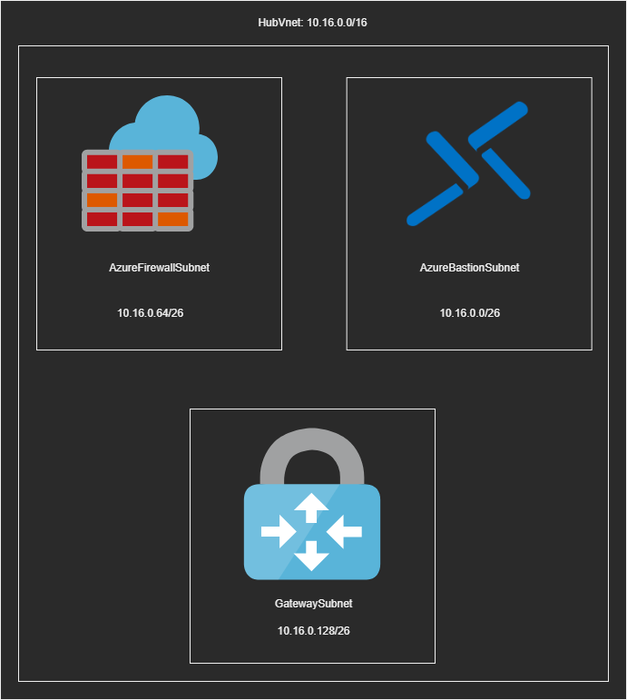
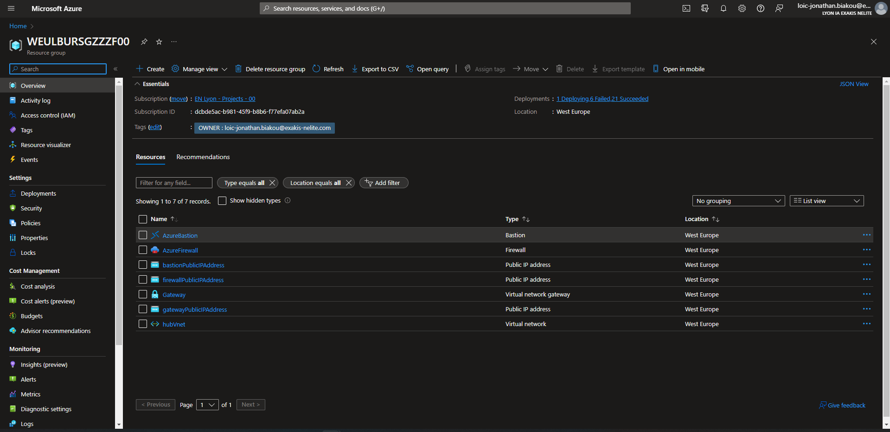
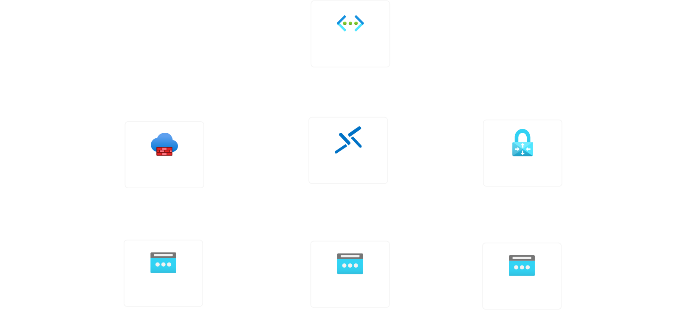
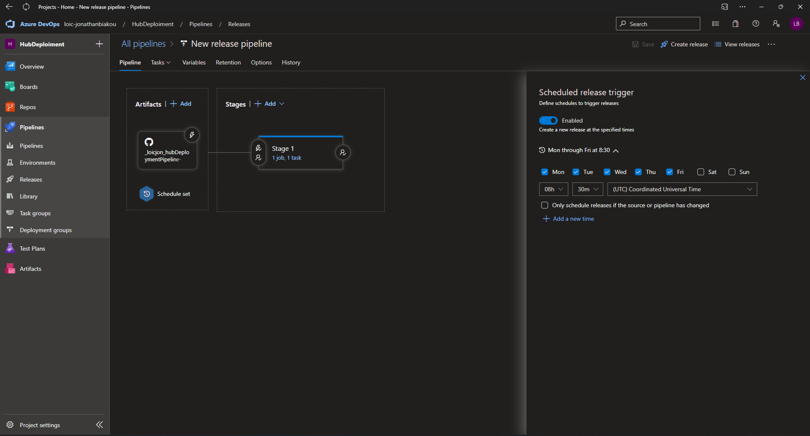
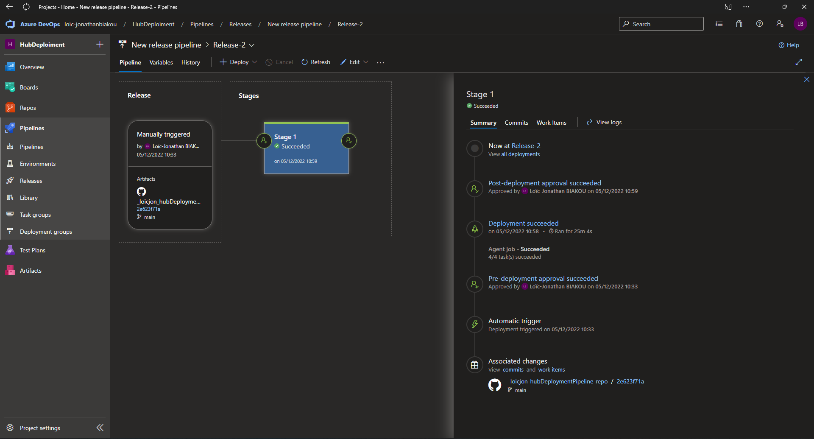
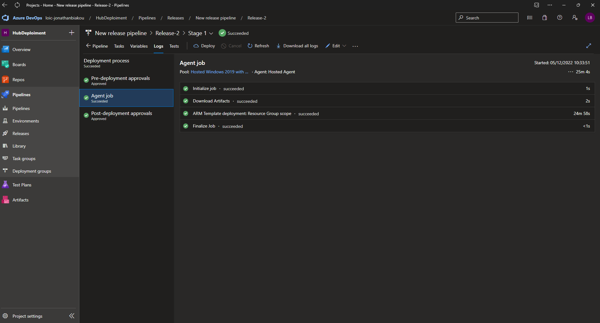

# tpHub-ARM

  

__https://github.com/loicjon/hubDeploymentPipeline-repo__

1. Adresse Ip :

* __Choix Subnet__  
- `Afin de Déployer nos ressources (Firewall, Bastion Gateway), on doit créer pour chacune des ressources un subnet Unique avec une convention de nommage spécifique.`  
- `Exemple: pour le firewall on doit créer un subnet AzureFirewallSubnet.`  
- `Chacune des ressources doit avoir un CIDR d'au moins /26.`

* __Découpage__  
- ` Chaque Subnet présent dans notre Vnet en /16, possède une Host Address Range de 63 adresses IP, auxquelles on retire la dernière adresse IP étantl'address de Broadcast.`  
- `Concrètement nous devons faire notre découpage de sorte qu'il n'y ait pas de "trous", ainsi on peut éviter le gaspillage.`
- `Exemple: 10.16.0.0 - 10.62.0.64 - 10.16.0.128 le 63 et le 127 étant l'address de Broadcast.`  

2. Template ARM et Automatisation avec Azure Devops.  

* __Template ARM__  
`On crée un fichier en .json en ayant au préalable installé l'extension ARM tools.`  
`Trois commande importante avant de pusher notre fichier .json dans un repos git: az login, az account set --subscription "nom de la subscription" et enfin az configure --defaults group=[nom du groupe de ressource dans lequel on travail]`  
`Puis on déploie avec "az deployment group create." `  

* __Azure Devops__  
`On relie Azure Devops à notre repos Github.`
`On commence par créer une chaine de connexion.`  
`Ensuite on peut procéder de deux manière: créer une pipeline, ou une release.`
`On peut ensuite paramétrer différent options comme mettre des triggers qui déclenche une pipeline quand on fait un push de nos modifications sur github On peut aussi programmer le déclenchement à des horaires bien précise.`  

3. Résultats  

     [arm](./arm.png)